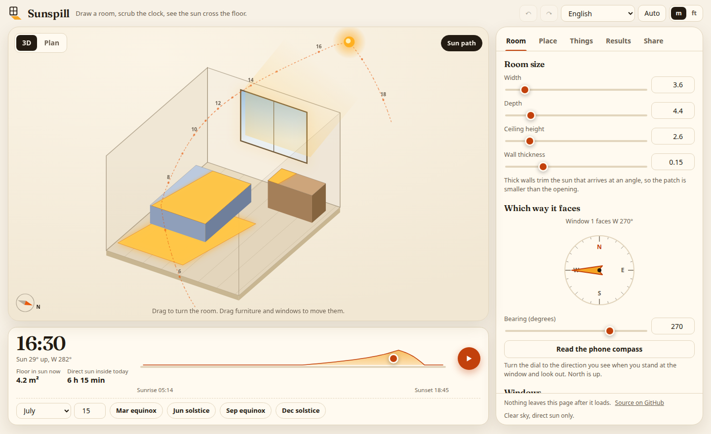
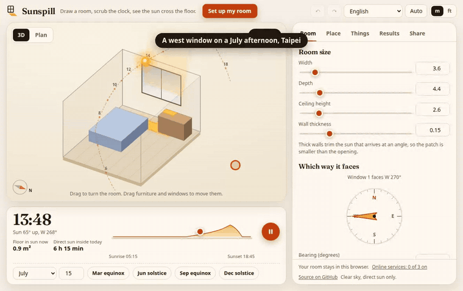
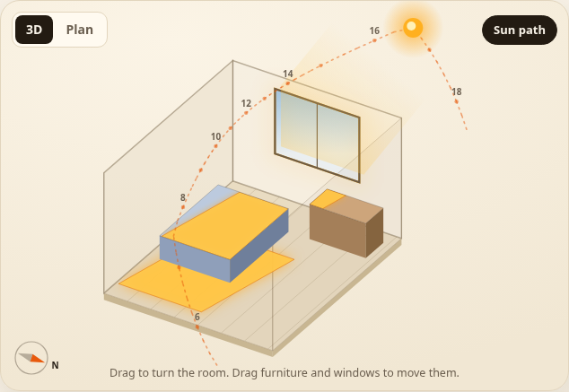
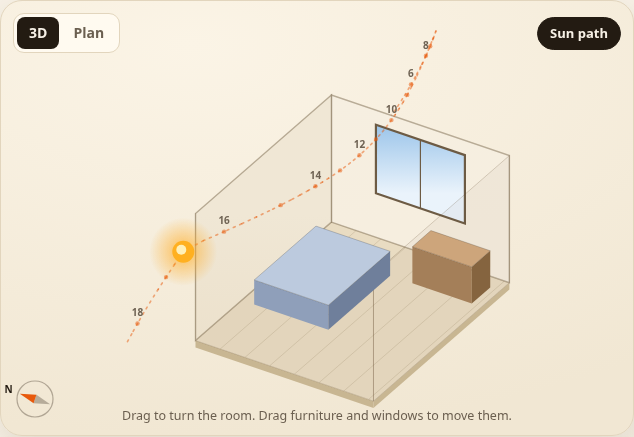
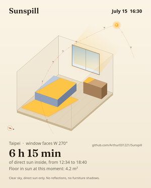
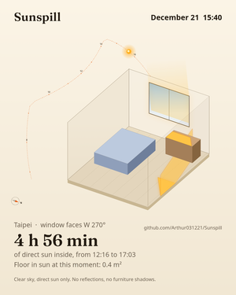
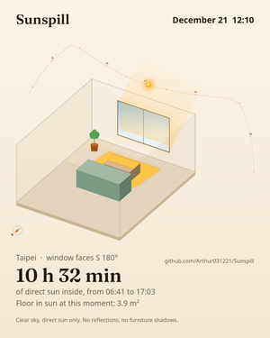
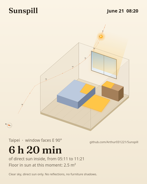

<h1 align="center">
  <picture>
    <source media="(prefers-color-scheme: dark)" srcset="assets/logo-dark.svg">
    
  </picture><br>
  Sunspill
</h1>

<p align="center"><strong>See where the sun lands in your room, by the hour and the season, before you rent, buy blinds or move a plant.</strong></p>

<p align="center">
  <a href="https://github.com/Arthur031221/Sunspill/actions/workflows/ci.yml"></a>
  <a href="LICENSE"></a>
  <a href="https://arthur031221.github.io/Sunspill/"></a>
  <a href="https://github.com/Arthur031221/Sunspill/stargazers"></a>
</p>

<p align="center">
  <a href="README.md">English</a> | <a href="README.zh-TW.md">zh-TW</a> | <a href="README.zh-CN.md">zh-CN</a> | <a href="README.ja.md">ja</a> | <a href="README.ko.md">ko</a> | <a href="README.es.md">es</a> | <a href="README.fr.md">fr</a> | <a href="README.de.md">de</a> | <a href="README.pt-BR.md">pt-BR</a>
</p>

<p align="center">
  <picture>
    <source media="(prefers-color-scheme: dark)" srcset="assets/hero-dark.png">
    
  </picture>
</p>

<p align="center">
  Sun elevation within <b>0.007 degrees</b> of the NREL reference. <b>0 of 3.77 million</b> probe points where the window light disagrees with an independent ray tracer.<br>
  <sub>Sun: 403 samples in 15 cities, 5 days and 6 times of day, against the NREL Solar Position Algorithm through pvlib 0.16.1. Azimuth is within 0.06 degrees. Light: 3,767 random rooms with windows, shades, buildings across the street and wall thickness, 5 seeds, compared with a ray tracer that shares no code with it. <code>node scripts/validate.mjs</code> reproduces both. <a href="docs/VALIDATION.md">docs/VALIDATION.md</a> lists what isn't checked.</sub>
</p>

It isn't a rendering or an AR app. The patch on your floor is an exact polygon, and you can check it against a ray tracer.

**[Open the live demo](https://arthur031221.github.io/Sunspill/)** and drag the clock. It's free, needs no login, sends nothing anywhere and opens offline after the first visit.

<p align="center"></p>

## Before and after

The same bedroom in Taipei at 16:30 on 15 July. Turn the window from west to east and the afternoon changes completely.

| West window | East window |
| :---: | :---: |
|  |  |
| **4 h 28 min** of direct sun a day after 14:00 | **0 min** |

<sub>Average per day over 40 sample days from June to September (every third day), clear sky, direct sun only, from the Afternoon sun check in the Results tab. The rule is printed in the app.</sub>

## Why I built it

> *West sun is a standing worry for people who rent in Taiwan, and a listing photo cannot show what it will do in your room.*

A compass app gives you an angle. A map shadow tool draws the buildings in the street. Neither shows the patch of light on the floor of the room you're about to sign for. Sunspill does. You describe the room, the window and the shade above it, pick a place and a date, and the patch moves as you drag the clock. The same engine answers the other questions people ask about light: how many hours a desk or a plant gets, and which corner is best.

## What it makes

<table align="center">
  <tr>
    <td align="center"><a href="assets/cards/west-july.png"></a><br><sub><i>West bedroom, 15 July, 16:30</i></sub></td>
    <td align="center"><a href="assets/cards/west-december.png"></a><br><sub><i>Same room, 21 December</i></sub></td>
    <td align="center"><a href="assets/cards/south-winter.png"></a><br><sub><i>South room, noon in winter</i></sub></td>
    <td align="center"><a href="assets/cards/east-morning.png"></a><br><sub><i>East bedroom, summer morning</i></sub></td>
  </tr>
</table>

*New in 0.1: 1080 by 1350 share cards, a 540 pixel GIF of the sun crossing the room, the sun hours map, the afternoon check, a plant spot finder, nine languages and a library for the sun and light code.*

## What you can do

- **Draw the room.** Size, wall thickness, up to four windows, and for each window a shade or balcony above it and a building across the street. Drag windows along their walls and furniture across the floor.
- **Scrub any day.** Pick a city from the built-in list, your location or a latitude and longitude. The clock, the sun path and the patch follow, with daylight saving handled.
- **See hours, not guesses.** The sun hours map colours the floor, or a surface at a height you set, by the hours of direct sun per day for a day, a month, a year or a range of months. Hover for the number.
- **Check the afternoon.** A printed rule, not a score: the minutes after a time you choose when direct sun reaches the floor or a wall, averaged over the months you choose.
- **Find a spot for a plant.** Full sun, partial sun or low light, for a 30 cm footprint, ranked, at least 60 cm apart.
- **Share it.** A link that holds the whole room, a PNG card, a GIF, or the room as a JSON file. One switch rounds the place to whole degrees and drops its name from all of them.
- **Use it anywhere.** Nine languages, light and dark themes, keyboard and touch, phone layout, undo and redo, offline after the first visit.

## Install

<details>
<summary><b>In the browser (recommended)</b></summary>

Open <https://arthur031221.github.io/Sunspill/>. Nothing to install. After one visit it opens with no connection. CI tests it in Chromium and Firefox. Safari isn't tested.
</details>

<details>
<summary><b>From the repository</b></summary>

```sh
git clone https://github.com/Arthur031221/Sunspill.git
cd Sunspill
npm ci
npm run build
npx --yes serve dist
```
</details>

<details>
<summary><b>On your own site</b></summary>

Copy `dist/index.html` and `dist/sw.js` to any static host. The page asks for no network access at all, so it works under a strict Content Security Policy. See [docs/INSTALL.md](docs/INSTALL.md).
</details>

<details>
<summary><b>As a library</b></summary>

```sh
npm install github:Arthur031221/Sunspill
```

```js
import { defaultScene, sunAt, scenePatches, totalArea } from 'sunspill'

const scene = defaultScene()                       // a west facing bedroom in Taipei
const sun = sunAt(scene.place, 7, 15, 16 * 60 + 30) // 16:30 on 15 July
const { floor } = scenePatches(scene, { azimuth: sun.azimuth, elevation: sun.elevation })
console.log(`${totalArea(floor).toFixed(1)} square metres of floor in sun`)
```

No dependencies, no DOM, runs in Node 20 or newer and in the browser. See [docs/API.md](docs/API.md).
</details>

## How it works

The sun position follows the NOAA equations. A window opening is trimmed by the wall thickness and the shadows of the shade and the building across the street, which leaves a few convex pieces. Each piece is carried along the sun rays onto the floor and walls and clipped there. The room is convex, so a ray that gets in meets the boundary once and nothing inside can block it. Hours come from stamping those patches onto a grid through the day. [docs/ARCHITECTURE.md](docs/ARCHITECTURE.md) has the details and [docs/VALIDATION.md](docs/VALIDATION.md) says what was compared with what.

What it leaves out is listed on the page and on every picture it exports: clear sky and direct sun only, no reflections, no furniture shadows, one box shaped room. Beams almost parallel to a wall are ignored. I have not compared the model with a photograph of a real room yet. If you can take one, [please open an issue](CONTRIBUTING.md#real-rooms).

## Docs

[Usage](docs/USAGE.md) | [Install](docs/INSTALL.md) | [Config and file format](docs/CONFIG.md) | [Library API](docs/API.md) | [Architecture](docs/ARCHITECTURE.md) | [Validation](docs/VALIDATION.md) | [Contributing](CONTRIBUTING.md)

## Planned

L shaped rooms. Tracing a wall on a satellite map to set the direction. Vertical fins and blinds. Shadows from furniture. A comparison with a photographed room. Published npm package.

## Related tools

[SunCalc](https://github.com/mourner/suncalc) gives sun angles as a library. Sunspill uses its own NOAA implementation, checked against NREL. [building-sunlight-simulator](https://github.com/SeanWong17/building-sunlight-simulator) shows building shadows for housing estates. The [Flat Sun and Shade Simulator](https://www.smartcalculator.sg/housing/flat-sun-shade-simulator) covers flats in Singapore. Sunspill is for the inside of one room, anywhere, with the code open.

## License

MIT. The Fraunces font is embedded under the SIL Open Font License. See [THIRD_PARTY.md](THIRD_PARTY.md).
