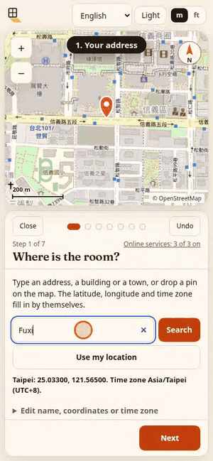

<h1 align="center">
  <picture>
    <source media="(prefers-color-scheme: dark)" srcset="assets/logo-dark.svg">
    
  </picture><br>
  Sunspill
</h1>

<p align="center"><strong>几分钟设置好你自己的房间，看阳光在每个时刻、每个季节落在地板的哪里。</strong></p>

<p align="center">
  <a href="https://github.com/Arthur031221/Sunspill/actions/workflows/ci.yml"></a>
  <a href="LICENSE"></a>
  <a href="https://arthur031221.github.io/Sunspill/"></a>
  <a href="https://github.com/Arthur031221/Sunspill/releases"></a>
  <a href="https://github.com/Arthur031221/Sunspill/stargazers"></a>
</p>

<p align="center">
  <a href="README.md">English</a> | <a href="README.zh-TW.md">zh-TW</a> | <a href="README.zh-CN.md">zh-CN</a> | <a href="README.ja.md">ja</a> | <a href="README.ko.md">ko</a> | <a href="README.es.md">es</a> | <a href="README.fr.md">fr</a> | <a href="README.de.md">de</a> | <a href="README.pt-BR.md">pt-BR</a>
</p>

<table align="center">
  <tr>
    <td valign="middle">
      <picture>
        <source media="(prefers-color-scheme: dark)" srcset="assets/hero-dark.png">
        
      </picture>
    </td>
    <td valign="middle"></td>
  </tr>
</table>

<p align="center">
  太阳仰角与 NREL 参考值相差在 <b>0.007 度</b>内。建筑、树木和阳台遮住窗户的计算，与 pvlib 和 shapely 比对，<b>54,000 个探测点有 0 处不一致</b>（其中 1,275 点只因建筑、树木或阳台栏杆而变暗）。<br>
  <sub>每一个几何环节都和独立的参考值比对：太阳（pvlib、NREL SPA）、阴影（光线追踪程序和 shapely）、磁偏角（pygeomag）、地图位移（pyproj）、照片展平（OpenCV）。用 <code>node scripts/validate.mjs</code> 可以复现，没有验证的选择写在 <a href="docs/VALIDATION.md">docs/VALIDATION.md</a>。它还没有和实拍的房间照片比对过，所以有一个核对模式，让你拿模型和亲眼看到的阳光比。<a href="docs/ACCURACY.md">docs/ACCURACY.md</a> 说明每个输入错了会让光斑偏多少。</sub>
</p>

不是拟真渲染，也不是 AR 应用。地板上的光斑是精确的多边形，而且可以拿光线追踪程序来核对。

**[打开在线演示](https://arthur031221.github.io/Sunspill/)** 。免费、不用登录，第一次打开之后也能离线使用。你的房间只留在浏览器里。地址搜索、地图和建筑轮廓会向 OpenStreetMap 请求数据，但每一项都要你同意才会进行。

## 设置你自己的房间

点「设置我的房间」。在手机上只要几分钟，共七步，每步都有上一步和下一步。

1. **在哪里。** 输入地址，或在 OpenStreetMap 地图上放一个图钉。纬度、经度和时区会自动填入。
2. **房间。** 从台湾常见的套房、卧室、客厅或书房开始，或用两点比例尺描绘你自己的平面图或挂牌照片。设置楼层。
3. **窗户与门。** 沿墙显示真实尺寸，会吸附到墙端、中间和彼此，还有阳台与栏杆、雨篷和门。
4. **朝哪个方向。** 在地图上把房间对着你的建筑轮廓转动，或把手机贴在窗边读取罗盘（会加上磁偏角）。画面上永远看得到北。
5. **周围有什么。** 邻近建筑与高度从 OpenStreetMap 加载。推测的高度会标示，也能修改。也可以自己加建筑和树。地图上的时钟会显示太阳的位置，并框出那个时间会遮住窗户的建筑。
6. **家具。** 放置、拖动、旋转床、书桌、沙发、书架和植物，看阳光落在上面。
7. **与真实阳光对照。** 标出你看到阳光的时间，阳光在地板上的位置，或把地板照片铺在平面图下。Sunspill 会显示模型偏了多少，并按你的标记调整朝向和窗户。

## 前后对照

同一间台北的卧室，7 月 15 日 16:30。把窗户从西边转到东边，下午的阳光就没了。

| 西侧窗户 | 东侧窗户 |
| :---: | :---: |
|  |  |
| 14:00 之后每天直射阳光 <b>4 小时 28 分</b> | <b>0 分</b> |

<sub>6 月到 9 月共 40 个取样日（每三天一天）的每日平均，晴天、只算直射阳光，数字来自「结果」页的午后阳光检查，规则也印在应用里。</sub>

## 可以做什么

- **画出房间。** 尺寸、墙厚、最多四扇窗（可设遮阳、阳台和栏杆）、最多三扇门、楼层，以及可旋转的家具。
- **拖动任何一天。** 从城市、地址、你的位置或经纬度选地点，时钟、太阳轨迹和光斑跟着动，夏令时也处理好了。
- **看是什么挡住阳光。** OpenStreetMap 的建筑与高度、树木，还有你自己的阳台和雨篷。逐个关掉，就知道少了几小时日照。
- **看时数，不靠猜。** 日照时数图用每天直射阳光的时数给地板（或你指定高度的平面）上色。
- **检查午后阳光。** 印出来的规则，不是分数：你指定时间之后，直射阳光照到地板或墙面的分钟数。
- **给植物找位置。** 全日照、半日照或耐阴，排出最佳位置。
- **和现实比对。** 标出你看到的光斑，看重叠程度和以厘米计的偏差，并调整朝向。
- **分享。** 链接里就有整个房间，也能存成 PNG 图卡、GIF 或 JSON 文件。一个开关可把地点四舍五入到整数度并去掉名称。
- **到处都能用。** 九种语言、浅色与深色主题、键盘与触控、撤销与重做，第一次打开之后可离线使用。

没有纳入：反射、天空散射光、家具影子。晴天、只算直射阳光。建筑视为平顶的柱体，树视为不透光。这个模型还没有和实拍的房间照片比对过，如果你能拍一张，欢迎开 issue。

## 隐私

你的房间、你描绘的图片和你做的标记都不会离开浏览器。没有账号、没有统计、没有 cookie。有三项可选服务会向 OpenStreetMap 的服务器请求数据，每一项都默认关闭，要你同意，而且页面会先说明会发出什么：

| 服务 | 发出的内容 |
| --- | --- |
| 地址搜索（Nominatim） | 你输入的文字 |
| 地图图片（OpenStreetMap 图块） | 你正在看的那一块地图 |
| 建筑轮廓（Overpass） | 房间的位置，约精确到一米 |

随时可以在「在线服务」里关掉。页面的内容安全策略只列出这几个主机，浏览器测试也会检查。详见 [docs/PRIVACY.md](docs/PRIVACY.md)。

## 安装

直接在浏览器打开 <https://arthur031221.github.io/Sunspill/> 就能用，不用安装。想自己跑：

```sh
git clone https://github.com/Arthur031221/Sunspill.git
cd Sunspill
npm ci
npm run build
npx --yes serve dist
```

## 文档

文档为英文。 [Usage](docs/USAGE.md) | [Privacy](docs/PRIVACY.md) | [Accuracy](docs/ACCURACY.md) | [Validation](docs/VALIDATION.md) | [Install](docs/INSTALL.md) | [Config and file format](docs/CONFIG.md) | [Library API](docs/API.md) | [Architecture](docs/ARCHITECTURE.md) | [Contributing](CONTRIBUTING.md) | [Changelog](CHANGELOG.md)

## 许可与数据

MIT。内嵌的 Fraunces 字体采用 SIL Open Font License。地图图片、建筑轮廓和地址搜索来自 OpenStreetMap 贡献者，采用 Open Database License。时区表是 `@photostructure/tz-lookup`（CC0），磁场模型是 World Magnetic Model 2025（公有领域）。见 [THIRD_PARTY.md](THIRD_PARTY.md)。
